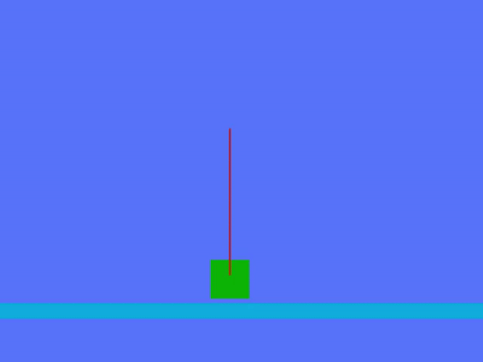

# simple-love2d-pid
Playing Around with the Partial-Integral-Derivate controls algorithm

The PID is allowed to produce forces on the x axis of the green cart.
It gradually stabilizes the pole until the forces required to keep it in the air are exceptionally small.
Also, a correction to the PID is added so that the cart is centered on the blue platform, so that it doesn't accidentally run
into the walls (which are not pictured in the gif).

Created using <a href="http://love2d.org" target="blank">löve2d</a> version 11.2
